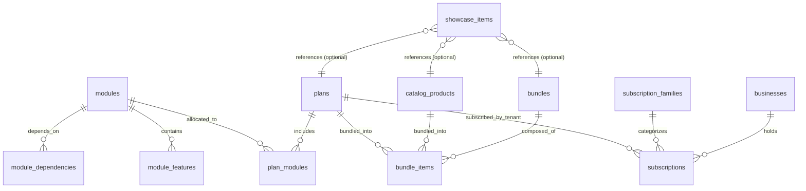

# PHASE SA-2.0 — COMMERCIAL DOMAIN CONTRACT
## Architectural Specification & Domain Contract Lock

**Status:** DOMAIN CONTRACT SPECIFICATION (AUDIT & DESIGN ONLY — NO CODE CHANGES)
**Track:** Superadmin Control Plane (SA Track)
**Phase:** SA-2.0
**Baseline Commit:** `ee8965b426c42c47405b69f30bd478274947c29f`
**Date:** September 1, 2026

---

## Metodologi Dokumen
Setiap pernyataan teknis dalam dokumen ini diklasifikasikan secara ketat menjadi 3 tingkatan kepastian:
- **`[FACT]`**: Fakta terbukti dari kode sumber, migration SQL, dan skema database aktif yang sudah berjalan di repository.
- **`[RECOMMENDATION]`**: Keputusan arsitektur terbaik yang dirancang untuk mengunci domain komersial SA-2 secara aman dan skalabel.
- **`[OPEN QUESTION]`**: Pertanyaan kebijakan bisnis/operasional yang memerlukan keputusan pengguna sebelum eksekusi migrasi.

---

## 1. Domain Entities & Definisi Batas (Bounded Contexts)

Untuk menjaga integritas data dan mencegah percampuran konteks (*domain pollution*), platform mengunci 5 entitas domain komersial:

```
┌─────────────────────────────────────────────────────────────────────────────┐
│ 1. CATALOG PRODUCTS (catalog_products)                                      │
│    [FACT]: Didefinisikan di migration 015.                                  │
│    Definisi: Katalog master barang/layanan/konektivitas milik PLATFORM.     │
│    Kepemilikan: Superadmin / Platform Level (Global).                       │
│    Contoh: "Bandwidth Internet 50Mbps", "Router MikroTik", "CCTV Dome 2MP".  │
└─────────────────────────────────────────────────────────────────────────────┘
                                    │
                                    ▼ (Komposisi)
┌─────────────────────────────────────────────────────────────────────────────┐
│ 2. PLANS (plans) & PLAN MODULES (plan_modules)                              │
│    [FACT]: Didefinisikan di migration 015.                                  │
│    Definisi: Paket langganan software ERP yang menentukan modul/fitur       │
│              yang diperoleh tenant (Entitlement).                           │
│    Kepemilikan: Superadmin / Platform Level (Global).                       │
│    Contoh: "ERP Starter (Kasir only)", "ERP Pro (POS + Inv + Finance)".     │
└─────────────────────────────────────────────────────────────────────────────┘
                                    │
                                    ▼ (Komposisi Multi-Item)
┌─────────────────────────────────────────────────────────────────────────────┐
│ 3. COMMERCIAL BUNDLES (bundles & bundle_items)                              │
│    [FACT]: Didefinisikan di migration 015.                                  │
│    Definisi: Paket bundling komersial lintas pilar (Internet + Plan + Alat).│
│    Kepemilikan: Superadmin / Platform Level (Global).                       │
│    Contoh: "Paket Smart Warung" = (Internet 30Mbps + ERP Pro + Router).     │
└─────────────────────────────────────────────────────────────────────────────┘
                                    │
                                    ▼ (Penerbitan Publik)
┌─────────────────────────────────────────────────────────────────────────────┐
│ 4. LANDING SHOWCASE & PUBLISHING (landing_showcase / presentation_metadata) │
│    [RECOMMENDATION]: Pemisahan etalase publik dari master data.             │
│    Definisi: Aturan kurasi item apa saja yang tampil di Landing Page,       │
│              section penempatan, display order, badge, dan marketing copy.  │
│    Kepemilikan: Superadmin Marketing Control Plane.                         │
└─────────────────────────────────────────────────────────────────────────────┘
                                    │
                                    X (ISOLASI TOTAL - ZERO OVERLAP)
┌─────────────────────────────────────────────────────────────────────────────┐
│ 5. TENANT OPERATIONAL PRODUCTS (products)                                   │
│    [FACT]: Didefinisikan di migration 001.                                  │
│    Definisi: Barang dagangan/inventaris milik masing-masing TENANT.         │
│    Kepemilikan: Tenant Owner / Cashier (Terikat business_id).               │
│    Contoh: "Beras Rojolele 5kg", "Kopi Susu Gula Aren", "Indomie Goreng".   │
└─────────────────────────────────────────────────────────────────────────────┘
```

---

## 2. Entity Relationships & Data Model



### [FACT] Struktur Kolom Existing (Migration 015 & 016):
- `catalog_products`: `(code PK, name, type, category, billing_model, base_price, currency, tax_rate, metadata, status, created_at, updated_at)`
- `plans`: `(code PK, name, family, tier, billing_cycle, pricing JSONB, type, status, metadata, created_at, updated_at)`
- `plan_modules`: `(plan_code, module_code, feature_overrides JSONB, created_at)`
- `bundles`: `(code PK, name, pricing JSONB, target_segment, installation_required, installation_service_code, presentation_metadata JSONB, status, created_at, updated_at)`
- `bundle_items`: `(id BIGSERIAL PK, bundle_code, item_type, item_code, quantity, required, created_at)`
- `subscriptions`: `(id UUID PK, business_id, plan_code, family_code, source, status, starts_at, ends_at, trial_ends_at, unit_price, discount, tax, final_price, currency, billing_cycle, metadata, created_at, updated_at)`

---

## 3. State Machines & Lifecycle Governance

### A. Catalog Products, Plans & Bundles Lifecycle:
```
[ DRAFT ] ──(Publish/Activate)──► [ ACTIVE ] ──(Deprecate/Archive)──► [ DEPRECATED ]
    ▲                                │
    └──────────(Revert)──────────────┘
```
1. **`DRAFT`**:
   - Item sedang dirancang oleh Superadmin (konfigurasi harga, modul, atau item bundle belum final).
   - **Visibilitas:** Hanya terlihat di Superadmin Console. Tidak muncul di pilihan tenant dan dilarang muncul di Landing Page publik.
2. **`ACTIVE`**:
   - Item resmi berlaku secara komersial.
   - **Visibilitas:** Dapat dilanggani oleh tenant. Dapat dipublish ke Landing Page jika flag publik aktif.
3. **`DEPRECATED`**:
   - Item sudah usang / tidak lagi dijual ke tenant baru.
   - **Integritas:** Tenant yang *sudah* berlangganan paket ini tetap aktif sampai masa berlakunya habis (`ON DELETE RESTRICT`). Paket tidak dapat dipilih oleh pendaftar baru dan otomatis hilang dari Landing Page publik.

### B. Subscription Lifecycle `[FACT]`:
Ditegakkan oleh trigger database `validate_subscription_lifecycle` (migration 016):
- `PENDING` $\rightarrow$ `ACTIVE` | `CANCELLED`
- `ACTIVE` $\rightarrow$ `SUSPENDED` | `EXPIRED` | `CANCELLED`
- `SUSPENDED` $\rightarrow$ `ACTIVE` | `EXPIRED` | `CANCELLED`
- `EXPIRED` $\rightarrow$ `CANCELLED`
- `CANCELLED` $\rightarrow$ Terminal (Tidak dapat bertransisi lagi).

---

## 4. Pricing & Money Contract Specification

### A. [FACT] Kontrak Moneter Kanonikal:
- Seluruh kolom harga menggunakan representasi **Integer/BigInt Rupiah Langsung**:
  $$\text{Nilai Minor} = \text{Nominal IDR Nyata}$$
  *Contoh:* `Rp 450.000` disimpan sebagai `450000` (Bukan `45000000` dan bukan `4500`).
- Dilarang keras melakukan operasi pembagian `/ 100` pada nominal uang.

### B. [RECOMMENDATION] Formulasi Kalkulasi Harga Paket (`plans.pricing`):
Struktur JSONB `pricing` pada `plans` diwajibkan mengikuti skema terstandarisasi:
```json
{
  "base_price": 500000,
  "discount": 50000,
  "tax_rate_bps": 1100,
  "tax": 49500,
  "final_price": 499500,
  "currency": "IDR"
}
```
* **Rumus Perhitungan:**
  1. $\text{Taxable Amount} = \text{base\_price} - \text{discount}$
  2. $\text{Tax} = \text{round}\left(\text{Taxable Amount} \times \frac{\text{tax\_rate\_bps}}{10000}\right)$
  3. $\text{final\_price} = \text{Taxable Amount} + \text{Tax}$

### C. [RECOMMENDATION] Grandfathering Policy (Imutabilitas Harga Langganan Berjalan):
- **Prinsip Bisnis:** Perubahan harga pada katalog master `plans` **TIDAK BOLEH** mengubah harga `subscriptions` tenant yang sedang aktif secara retroaktif.
- **Mekanisme:** Tabel `subscriptions` menyimpan *snapshot harga historis* (`unit_price`, `discount`, `tax`, `final_price`) saat langganan dibuat/diperpanjang. Perubahan harga pada master `plans` hanya berlaku untuk langganan baru atau saat renewal resmi.

---

## 5. Bundle Architecture & Governance Contract

### A. [FACT] Komposisi Multi-Pilar:
Sebuah bundle (`bundles`) dapat terdiri dari berbagai tipe item (`bundle_items.item_type`):
- `PLAN`: Paket software ERP (e.g. `ERP_RETAIL_PRO`).
- `PRODUCT`: Layanan konektivitas ISP atau CCTV platform (e.g. `INTERNET_50M`, `CCTV_CLOUD_4CAM`).
- `HARDWARE`: Perangkat fisik (e.g. `ROUTER_MIKROTIK_HEX`, `IP_CAMERA_2MP`).
- `SERVICE`: Jasa instalasi/maintenance (e.g. `INSTALLATION_FIBER_STD`).

### B. [RECOMMENDATION] Aturan Komposisi Bundle:
1. **Quantity Support:** Setiap item dalam `bundle_items` memiliki kolom integer `quantity >= 1` `[FACT]`.
2. **Penetapan Harga Bundle:** Bundle memiliki skema harga independen (`pricing JSONB` memuat `one_time` untuk biaya pasang/perangkat dan `monthly` untuk biaya langganan bulanan) yang biasanya lebih hemat dibanding penjumlahan harga satuan (*bundled discount*).
3. **Penanganan Item Non-Aktif:** Jika salah satu item pembentuk bundle berstatus `DEPRECATED` atau `DRAFT`, bundle tersebut otomatis divalidasi tidak dapat dipublish (`is_published = false`) sampai komposisinya diperbarui oleh Superadmin.

---

## 6. Showcase & Landing Page Publishing Contract

### A. Jawaban Arsitektur Pertanyaan A & B (Model Penyimpanan Publishing):

> **[RECOMMENDATION ARSITEKTUR KUNCI]:**
> Mengadopsi pendekatan **Dedicated Showcase Entity (`showcase_items`)** yang didukung dengan fallback direct flags pada entitas master.

#### Alasan Arsitektur:
1. **Multi-Section Placement:** Satu paket atau bundle dapat muncul di beberapa tempat di landing page (misal: muncul di section *"Paket Unggulan Beranda"* dengan urutan #1, sekaligus muncul di section *"Katalog Lengkap ERP"* dengan urutan #3).
2. **Kustomisasi Copy Marketing:** Teks teknis pada master `plans` (e.g. nama internal: `ERP_PRO_RETAIL_V2_MONTHLY`) seringkali berbeda dengan teks persuasif marketing di Landing Page (e.g. Judul: *"Paket Juara UMKM"*, Subtitle: *"Solusi terlengkap kasir & stok toko grosir"*).
3. **Decoupling:** Perubahan banner marketing atau urutan tampil tidak memicu mutasi pada tabel inti billing `plans`.

### B. Skema Showcase Entity (`showcase_items`):
```sql
CREATE TABLE IF NOT EXISTS showcase_items (
    id UUID PRIMARY KEY DEFAULT gen_random_uuid(),
    section TEXT NOT NULL CHECK (section IN ('HERO_FEATURED', 'ERP_PLANS', 'ISP_PLANS', 'BUNDLES', 'HARDWARE')),
    item_type TEXT NOT NULL CHECK (item_type IN ('PLAN', 'BUNDLE', 'PRODUCT', 'CUSTOM')),
    item_code TEXT NOT NULL, -- references plans(code), bundles(code), or catalog_products(code)
    display_name TEXT NOT NULL,
    headline TEXT,
    description TEXT,
    marketing_badge TEXT, -- e.g. 'PALING POPULER', 'BEST VALUE', 'HEMAT 20%'
    features_list JSONB NOT NULL DEFAULT '[]', -- bullet points keunggulan
    display_order INTEGER NOT NULL DEFAULT 0,
    is_featured BOOLEAN NOT NULL DEFAULT FALSE,
    is_published BOOLEAN NOT NULL DEFAULT TRUE,
    cta_text TEXT NOT NULL DEFAULT 'Pilih Paket',
    cta_url TEXT NOT NULL DEFAULT '/register',
    created_at TIMESTAMPTZ NOT NULL DEFAULT now(),
    updated_at TIMESTAMPTZ NOT NULL DEFAULT now()
);
```

### C. Alur Kerja Publish / Unpublish:
1. **Publish:** Superadmin mengaktifkan switch publikasi $\rightarrow$ API memvalidasi status master item adalah `ACTIVE` $\rightarrow$ Item muncul di API publik.
2. **Unpublish:** Superadmin mematikan switch $\rightarrow$ Item seketika hilang dari API publik tanpa menghapus master data paket.
3. **Display Order:** Bilangan bulat non-negatif (`display_order ASC`), di mana nilai terkecil tampil paling kiri/atas.

---

## 7. Permission & RBAC Matrix (Platform vs Tenant)

| Endpoint / Operasi | Scope | Role Diizinkan | Perilaku Pelanggaran |
| :--- | :--- | :--- | :--- |
| `GET /v1/public/*` (Catalog, Plans, Bundles) | `public` | Siapa saja (Unauthenticated) | Always Allowed (200 OK) |
| `GET /v1/platform/plans`, `/bundles` | `platform`| `SUPER_ADMIN`, `PLATFORM_ADMIN` | HTTP 403 `WRONG_SCOPE` untuk tenant |
| `POST /v1/platform/plans`, `/bundles` | `platform`| `SUPER_ADMIN`, `PLATFORM_ADMIN` | HTTP 403 `WRONG_SCOPE` untuk tenant |
| `PUT /v1/platform/plans/:code`, `/bundles/:code` | `platform`| `SUPER_ADMIN`, `PLATFORM_ADMIN` | HTTP 403 `WRONG_SCOPE` untuk tenant |
| `PATCH /v1/platform/plans/:code/status` | `platform`| `SUPER_ADMIN` Only | HTTP 403 `INSUFFICIENT_PERMISSIONS` untuk Admin biasa |
| `DELETE /v1/platform/plans/:code` | `platform`| `SUPER_ADMIN` Only | Ditolak jika ada FK subscriptions aktif |
| `GET /v1/tenant/available-plans` | `tenant`  | `OWNER` | Hanya menampilkan paket `ACTIVE` |
| `POST /v1/tenant/subscriptions/select` | `tenant`  | `OWNER` | CASHIER ditolak (HTTP 403) |

---

## 8. Concurrency & Optimistic Locking

### [RECOMMENDATION] Mekanisme Pencegahan Konflik Edit Bersamaan:
1. Setiap entitas komersial (`plans`, `bundles`, `showcase_items`) memanfaatkan kolom `updated_at TIMESTAMPTZ` atau kolom `version INT NOT NULL DEFAULT 1`.
2. Saat Superadmin membuka drawer edit, frontend menyimpan `version` saat ini.
3. Saat melakukan submit update (`PUT /v1/platform/plans/:code`), request body menyertakan `expected_version` (atau header `If-Match`).
4. Database melakukan query:
   ```sql
   UPDATE plans
   SET name = $1, pricing = $2, updated_at = now()
   WHERE code = $3 AND updated_at = $4
   RETURNING *;
   ```
5. Jika baris yang diupdate = 0 (karena sudah diubah oleh admin lain di waktu bersamaan), API melempar error **HTTP 409 Conflict (`CONCURRENT_MODIFICATION`)**.

---

## 9. API Contract Specification (Public vs Platform vs Tenant)

### A. Public APIs (Konsumsi Landing Page & Calon Pelanggan):
- `GET /v1/public/showcase?section=ERP_PLANS`
  - *Response:* Daftar paket terkurasi untuk publik yang berstatus `is_published = true`, lengkap dengan harga, diskon, badge, bullet points, dan urutan tampil.
- `GET /v1/public/showcase?section=BUNDLES`
  - *Response:* Daftar bundle promo komersial.

### B. Platform Control Plane APIs (Superadmin Governance):
- `GET /v1/platform/plans` `[FACT - Implemented list]`: Query `?status=ACTIVE&family=ERP_PLAN&search=pro&limit=20&offset=0`.
- `GET /v1/platform/plans/:code` `[RECOMMENDATION]`: Detail lengkap paket, struktur pricing breakdown, modul terasosiasi, dan data showcase.
- `POST /v1/platform/plans` `[RECOMMENDATION]`: Membuat paket baru (status awal `DRAFT` atau `ACTIVE`).
- `PUT /v1/platform/plans/:code` `[RECOMMENDATION]`: Memperbarui informasi dan harga paket.
- `PATCH /v1/platform/plans/:code/status` `[RECOMMENDATION]`: Mengubah status (`ACTIVE`, `DRAFT`, `DEPRECATED`).
- `PUT /v1/platform/plans/:code/modules` `[RECOMMENDATION]`: Menetapkan modul dan feature overrides yang diperoleh paket.
- `GET /v1/platform/bundles` `[FACT - Implemented list]`
- `POST /v1/platform/bundles` & `PUT /v1/platform/bundles/:code` `[RECOMMENDATION]`
- `PUT /v1/platform/bundles/:code/items` `[RECOMMENDATION]`: Menetapkan komposisi multi-item bundle.
- `GET /v1/platform/showcase` & `PUT /v1/platform/showcase/:id` `[RECOMMENDATION]`: Mengelola etalase Landing Page.

### C. Tenant APIs (Akses Pelanggan Terdaftar):
- `GET /v1/plans/available` `[RECOMMENDATION]`: Menampilkan daftar paket resmi yang dapat dipilih tenant untuk upgrade/langganan.

---

## 10. Superadmin Console UI/UX Architecture

Konsol Superadmin (`/platform/plans` dan `/platform/bundles`) dirancang dengan standar enterprise kelas dunia:

```
┌─────────────────────────────────────────────────────────────────────────────┐
│ SUPERADMIN CONTROL PLANE — PLANS & PRICING                                  │
├─────────────────────────────────────────────────────────────────────────────┤
│ [ KPI Cards: Total Plans (12) | Active (8) | Draft (2) | Deprecated (2) ]  │
├─────────────────────────────────────────────────────────────────────────────┤
│ [Search Bar...] [Family Filter: All ▼] [Status Filter: Active ▼] [+ Plan]  │
├─────────────────────────────────────────────────────────────────────────────┤
│ Kode      | Nama Paket   | Family   | Siklus  | Harga Final | Publish | Aksi │
│ ERP-PRO   | ERP Pro Bisnis| ERP_PLAN | Bulanan | Rp 250.000  | [ON]    | [•••]│
│ ERP-BASIC | ERP Kasir Pos | ERP_PLAN | Bulanan | Rp  99.000  | [ON]    | [•••]│
│ ERP-ENTER | ERP Enterprise| ERP_PLAN | Tahunan | Rp2.400.000 | [OFF]   | [•••]│
└─────────────────────────────────────────────────────────────────────────────┘
```

### Fitur Interaktif UI:
1. **Interactive Price Simulator (Drawer Editor):**
   - Input *Harga Dasar (Rp)* dan *Diskon Promo (Rp)* dengan formatting otomatis Rupiah.
   - Input *Pajak PPN (%)* (default 11%).
   - Preview *Harga Final yang Diterima Pelanggan* terhitung secara real-time.
2. **Module Matrix Allocator:**
   - Daftar modul fungsional (POS, Inventaris, Keuangan, CRM, Pembelian) dengan checkbox dan badge pilar.
   - Pilihan sub-fitur per modul (e.g. Kasir Offline, Multi-Gudang).
3. **Bundle Visual Composer:**
   - Card container dengan tombol *"Tambah Item ke Bundle"*.
   - Dropdown pencarian item master (Plan ERP / Bandwidth Internet / Hardware / Jasa).
   - Input kuantitas dan toggle item wajib/opsional.
4. **Landing Page Preview Mode:**
   - Modal preview visual yang merender simulasi card etalase persis seperti yang akan dilihat pengunjung landing page.

---

## 11. Explicit Decisions Locked (Keputusan Final)

1. **[DECISION 1] Isolasi Database Moneter:**
   - Format moneter **`*_minor = RUPIAH LANGSUNG`** dipertahankan secara absolut di seluruh layer (database, backend, API, frontend).
2. **[DECISION 2] Imutabilitas Langganan Tenant:**
   - Perubahan harga master pada `plans` tidak merubah harga langganan aktif yang sedang berjalan milik tenant (`subscriptions`).
3. **[DECISION 3] Dedicated Showcase Entity:**
   - Etalase Landing Page dipisahkan ke dalam entitas showcase terkurasi untuk mendukung penempatan multi-seksi, urutan kustom, dan copy marketing tanpa membebani tabel billing.
4. **[DECISION 4] Zero Tenant Regression:**
   - Modul operasional tenant (POS, Finance, Inventory, Products, Print, Tenant Auth) sama sekali tidak diubah strukturnya pada fase SA-2.

---

## 12. Open Questions for User Consideration

> [!NOTE]
> Berikut adalah 2 pertanyaan kebijakan komersial untuk konfirmasi Anda:

1. **[OPEN QUESTION 1] Batas Kuota Sumber Daya (Resource Quotas):**
   - Apakah dalam paket langganan (`plans`) perlu disertakan batasan kuota numerik langsung (misal: Maksimal 3 Cabang, Maksimal 5 Kasir/Pengguna), atau batasan tersebut cukup dikendalikan via flag modul di SA-3?
   - *Rekomendasi Kami:* Menyediakan field JSONB `limits` opsional pada `plans` (e.g. `{"max_branches": 3, "max_users": 5}`) untuk fleksibilitas masa depan tanpa membebani skema saat ini.

2. **[OPEN QUESTION 2] Masa Uji Coba Gratis (Trial Period):**
   - Apakah setiap paket `ACTIVE` secara default mengizinkan trial 14 hari, atau durasi trial ditentukan spesifik per paket?
   - *Rekomendasi Kami:* Menambahkan field integer `trial_days INT DEFAULT 0` pada tabel `plans`.

---

## 13. Rekomendasi Eksekusi Phase SA-2.1 (Next Step)

Setelah kontrak domain ini disetujui, langkah berikutnya adalah eksekusi **Phase SA-2.1**:
1. Membuat migrasi database `034_commercial_governance_showcase.sql` (menambahkan entitas `showcase_items` dan field metadata pendukung pada `plans` & `bundles`).
2. Menghubungkan platform backend service untuk mutasi CRUD Plans, Bundles, dan Showcase API.

---

**DOMAIN CONTRACT LOCKED.** Menunggu konfirmasi Anda sebelum memulai pembuatan migrasi database SA-2.1.
