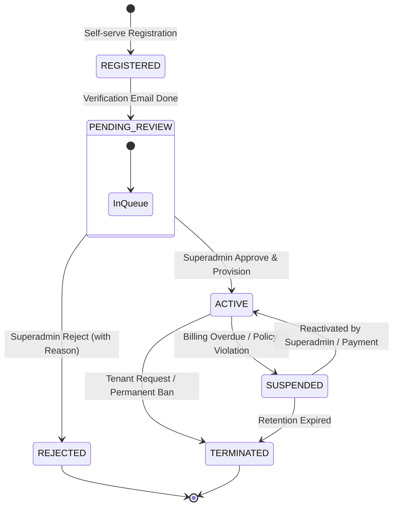
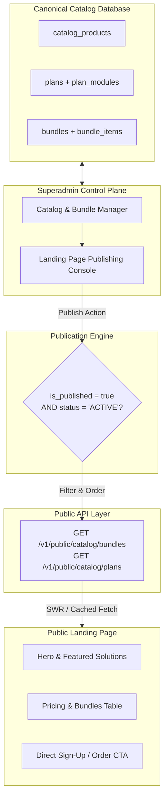

# SUPERADMIN FORENSIC ARCHITECTURE REPORT
## SKMNetwork Platform Control Plane Blueprint

**Status:** ARCHITECTURAL AUDIT & BLUEPRINT (AUDIT-ONLY)
**Baseline Commit:** `a164ee1972a6160dce22ffdadd4cf9e6f1d633d6`
**Repository:** `biz-erp` (mastoni/biz-erp)
**Date:** September 1, 2026

---

## 1. Executive Summary

Platform SKMNet-ERP saat ini telah memiliki fondasi operasional tenant yang solid (Auth, Multi-Tenant Session, Master Produk, Multi-Branch Inventaris & Stok Ledger, POS, Finansial & Pembukuan, CRM Pelanggan, dan Pembelian Supplier).

Namun, untuk mengarahkan platform menjadi solusi enterprise yang terkelola penuh secara terpusat, diperlukan **Superadmin Control Plane** yang bertindak sebagai **pusat gravitasi tata kelola platform** (*Platform Governance & Commercial Engine*), sementara modul-modul ERP tenant (POS, Finance, Inventory, Products, Sales, dll.) tetap beroperasi secara modular di dalam lingkup tenant masing-masing.

Audit arsitektural ini menetapkan strategi integrasi tanpa merombak atau membuang implementasi yang telah selesai:
1. **Memisahkan Platform Control Plane (`/platform/*`, `/v1/platform/*`) secara tegas dari Tenant ERP (`(authenticated)/*`, `/v1/*`)**.
2. **Menyambungkan Canonical Catalog (Phase 4.1.40B) & Subscription Lifecycle (Phase 4.1.40C) ke Superadmin**.
3. **Membangun Dynamic Publishing Pipeline dari Superadmin ke Landing Page (`apps/landing`)** agar katalog produk/paket tidak statis atau langsung mengekspos seluruh isi database secara mentah.
4. **Menerapkan Source of Truth Pricing terpusat** untuk mengeliminasi disparitas harga.
5. **Menegakkan Entitlement Engine di Backend API** sehingga hak akses modul tenant dikendalikan oleh langganan aktif, bukan sekadar UI hiding di frontend.

---

## 2. Existing Architecture & Baseline Audit

Arsitektur aktual repository saat ini tersusun atas 4 sub-sistem:

```
                                 ┌────────────────────────────────────────┐
                                 │       PUBLIC LANDING PAGE             │
                                 │         (apps/landing)                 │
                                 │   [Current: Static data.ts]            │
                                 └──────────────────┬─────────────────────┘
                                                    │ (Target: Dynamic Fetch)
                                                    ▼
┌─────────────────────────────────────────────────────────────────────────────────────────────────┐
│                                   CANONICAL BACKEND API (apps/api)                              │
├─────────────────────────────────────────┬───────────────────────────────────────────────────────┤
│       PLATFORM CONTROL PLANE SCOPE      │                   TENANT ERP SCOPE                    │
│        (jwt.scope = 'platform')         │                (jwt.scope = 'tenant')                 │
│  • Auth: requirePlatformRole()          │  • Auth: requireSyncAuth(), requireRole(OWNER/CASHIER)│
│  • Platform Context (/v1/platform/*)    │  • Tenant Isolation: assertTenant(req.tenantId)      │
│  • Read-only Overview API (40B/40C)     │  • Operational: Products, Stock, POS, Sales, Finance  │
└────────────────────┬────────────────────┴───────────────────────────┬───────────────────────────┘
                     │                                                │
                     ▼                                                ▼
┌─────────────────────────────────────────┐      ┌────────────────────────────────────────────────┐
│      SUPERADMIN WEB (apps/web)          │      │             WEB ERP (apps/web)                 │
│        Route Group: /platform/*         │      │          Route Group: /(authenticated)/*       │
│  • Guard: PlatformGuard                 │      │  • Guard: TenantGuard, BranchProvider          │
│  • Layout: PlatformLayout               │      │  • Shell: Sidebar, Header, TenantSwitcher      │
│  • Pages: Overview, Businesses, Plans,  │      │  • Modules: Dashboard, Products, Inventory,    │
│           Bundles, Modules, Subs        │      │             POS, Sales, Finance, Customers     │
└─────────────────────────────────────────┘      └────────────────────────────────────────────────┘
```

---

## 3. Domain Map: Existing vs Target

| Domain | Database Table | Backend Repository / Service | Backend Route | Frontend Route / API | Status Produksi Saat Ini | Gap Utama Superadmin |
| :--- | :--- | :--- | :--- | :--- | :--- | :--- |
| **AUTH & IDENTITY** | `users` (`platform_role`) | `user_repository.ts`, `jwt_service.ts` | `/v1/auth/login`, `/v1/auth/refresh` | `AuthContext.tsx`, `/login` | **READY (Dual-Scope)** | Belum ada manajemen User Platform oleh Superadmin |
| **TENANT / BUSINESS** | `businesses`, `user_businesses` | `business_repository.ts`, `platform_service.ts` | `/v1/platform/businesses`, `/v1/auth/register` | `/platform/businesses`, `TenantSwitcher.tsx` | **PARTIAL** | Tidak ada status lifecycle (`PENDING_APPROVAL`, `SUSPENDED`) & approval flow |
| **BRANCHES** | `branches` | `branch_repository.ts` | `/v1/branches` | `BranchContext.tsx`, `/inventory/branch` | **READY** | Scoped per tenant; Superadmin belum dapat mengaudit multi-branch tenant |
| **MODULES & PILLARS** | `modules`, `module_features`, `module_dependencies` | `platform_service.ts` (40B) | `GET /v1/platform/modules` | `/platform/modules` | **READ-ONLY** | Belum ada create/edit/toggle module status oleh Superadmin |
| **CATALOG PRODUCTS** | `catalog_products` | `platform_service.ts` (40B) | *Belum ada route CRUD publik/platform* | *Belum ada UI* | **SCHEMA ONLY** | Belum ada Product Manager & API publish |
| **PLANS & PRICING** | `plans`, `plan_modules` | `platform_service.ts` (40B) | `GET /v1/platform/plans` | `/platform/plans` | **READ-ONLY** | Belum ada Plan & Pricing Editor |
| **BUNDLES** | `bundles`, `bundle_items` | `platform_service.ts` (40B) | `GET /v1/platform/bundles` | `/platform/bundles` | **READ-ONLY** | Belum ada Bundle Composer & Pricing Manager |
| **SUBSCRIPTIONS** | `subscriptions`, `subscription_families` | `subscription_service.ts` (40C) | `GET /v1/platform/subscriptions`, `/v1/subscriptions` | `/platform/subscriptions` | **PARTIAL (Read-only)** | Superadmin belum dapat melakukan override/manual activation |
| **ENTITLEMENTS** | *Belum ada tabel dedicated* (diestimasi dari `plan_modules` & `subscriptions`) | *Belum ada Engine* | *Belum ada middleware* | Client-side RBAC only (`rbac.ts`) | **BLOCKED (Phase 40E)** | Tenant dapat mengakses API modul berbayar selama memiliki token valid |
| **LANDING PUBLISHING** | *Belum ada tabel* | *Belum ada API* | *Belum ada route* | `apps/landing/src/data.ts` (Hardcoded) | **HARDCODED STATIS** | Landing page terputus dari katalog platform database |
| **AUDIT LOGS** | *Belum ada tabel* | *Belum ada* | *Belum ada* | *Belum ada* | **MISSING** | Aksi Superadmin & perubahan sensitif tidak tercatat di audit trail |
| **FEATURE FLAGS** | *Belum ada tabel* | *Belum ada* | *Belum ada* | *Belum ada* | **MISSING** | Tidak ada mekanisme rollout fitur bertahap / maintenance mode |

---

## 4. Superadmin Control Plane Scope & Architecture

Superadmin Control Plane dirancang sebagai sistem kendali menyeluruh dengan pilar-pilar berikut:

```text
SUPERADMIN CONTROL PLANE
│
├── 1. TENANT MANAGEMENT & APPROVAL
│   ├── Registration Queue (Review, Approve, Reject)
│   ├── Tenant Directory (Search, Filter, Detail, Branch Audit)
│   └── Tenant Suspension / Reactivation / Termination
│
├── 2. COMMERCIAL ENGINE & CATALOG CONTROL
│   ├── Canonical Modules & Features Matrix (Pillars: Connect, Operate, Protect, Hardware, Services)
│   ├── Plan Management & Dynamic Pricing (Tiers: Standalone, Included, Trial, Promo)
│   ├── Bundle Management (Package Items, Pricing, Hardware Requirements)
│   └── Public Catalog Publishing (Publish/Unpublish, Featured, Display Order, Marketing Metadata)
│
├── 3. SUBSCRIPTION & ENTITLEMENT GOVERNANCE
│   ├── Tenant Subscription Ledger (State Machine: Pending -> Active -> Suspended -> Expired)
│   ├── Manual Provisioning / Direct Grant (Included with Internet / Promo / Enterprise)
│   └── Entitlement Policy Enforcement (Backend Middleware Engine)
│
├── 4. PLATFORM GOVERNANCE & OPERATIONS
│   ├── Audit Logs Trail (Who did what, when, IP, previous value, new value)
│   ├── Feature Flags Console (Global & Tenant-targeted flags)
│   ├── Platform Configuration (Tax rate default, Currency settings, System notifications)
│   └── Platform Monitoring (Active tenants, revenue run-rate, API health, error distribution)
```

---

## 5. Tenant Lifecycle State Machine

### Existing Flow (Uncontrolled):
Registrasi publik (`POST /v1/auth/register`) langsung membuat record di tabel `businesses` dan `user_businesses` dengan status langsung aktif tanpa verifikasi Superadmin.

### Target Controlled Lifecycle:



#### Lifecycle Rules:
1. **`REGISTERED / PENDING_REVIEW`**: User dapat login namun dibatasi hanya ke halaman *Onboarding Pending Screen* ("Menunggu Persetujuan Tim SKMNetwork"). Akses ke seluruh route ERP (`/dashboard`, `/pos`, dll.) diblokir oleh `TenantGuard`.
2. **`ACTIVE`**: Tenant disetujui, plan awal di-provision (Trial/Included/Purchased), dan modul aktif dapat diakses.
3. **`SUSPENDED`**: Akses ditangguhkan sementara (Read-Only atau Blocked).
4. **`REJECTED / TERMINATED`**: Token tenant dicabut, akses ditolak permanen.

---

## 6. Catalog, Bundle, & Landing Page Publishing Pipeline

Superadmin memegang kendali penuh atas produk dan bundel apa yang muncul di publik:



### Publication Metadata Fields:
* `is_published`: Boolean (Hanya item yang di-publish yang keluar di API publik).
* `is_featured`: Boolean (Menampilkan badge "Paling Populer" / "Rekomendasi").
* `display_order`: Integer (Urutan kartu pada landing page).
* `marketing_title` & `marketing_description`: Copywriting khusus halaman publik.
* `cta_label` & `cta_action`: Link pendaftaran atau kontak sales.

---

## 7. Pricing Control & Source of Truth

### Current Pricing Fragmentation:
* `apps/landing/src/data.ts`: Copywriting statis.
* `catalog_products.base_price`: `BIGINT` (minor units).
* `plans.pricing`: `JSONB` (`base_price`, `discount`, `tax`, `final_price`).
* `bundles.pricing`: `JSONB` (`one_time`, `monthly`, `commitment_months`).
* `subscriptions`: Snapshot harga saat transaksi (`unit_price`, `discount`, `tax`, `final_price`).

### Unified Pricing Governance:

```text
[SUPERADMIN PRICING CONSOLE]
              │
              ├── Mengatur base_price, tax_rate, discount
              ▼
   [CANONICAL CATALOG (plans / bundles)]  <--- SINGLE SOURCE OF TRUTH
              │
              ├── 1. Diterbitkan ke Public API ---> Landing Page (Realtime Dynamic)
              │
              └── 2. Diikat saat Transaksi/Provisioning ---> Subscriptions Snapshot
```

* **Aturan Mutlak**:
  1. Semua nominal moneter adalah **Integer Rupiah Langsung** (`*_minor` direct).
  2. Tabel `subscriptions` selalu menyimpan **price snapshot** historis saat langganan dibuat agar perubahan harga katalog di masa depan tidak merusak riwayat tagihan tenant yang sedang berjalan.

---

## 8. Entitlement & Module Control Engine

### Relasi Entitlement:
$$\text{Tenant} \xrightarrow{\text{memiliki}} \text{Subscriptions} \xrightarrow{\text{mengikat}} \text{Plan} \xrightarrow{\text{berisi}} \text{Plan Modules} \xrightarrow{\text{mengaktifkan}} \text{Entitlements}$$

### Dua Lapis Penegakan (*Two-Tier Enforcement*):

```text
1. SERVER-SIDE ENFORCEMENT (Mandatory Security Gate)
   Express Route Middleware:
   router.use('/v1/finance', requireSyncAuth(), requireEntitlement('FINANCE'), requireRole('OWNER'))
   → Jika tenant tidak memiliki langganan aktif untuk modul 'FINANCE', backend mengembalikan 403 MODULE_NOT_ENTITLED.

2. CLIENT-SIDE ENFORCEMENT (UX Dynamic Adaptation)
   React Hook & Layout Guard:
   const { hasEntitlement } = useEntitlements();
   → Menyembunyikan menu di Sidebar dan mengarahkan ke halaman Upgrade Plan jika membuka rute modul non-entitled.
```

---

## 9. RBAC & Security Boundary Matrix

| Aktor / Scope | Token Scope | Route Prefix | Hak Akses Utama | Larangan Keras |
| :--- | :--- | :--- | :--- | :--- |
| **`SUPER_ADMIN`** | `platform` | `/v1/platform/*`, `/platform/*` | Akses penuh ke seluruh konfigurasi platform, approval tenant, katalog, bundle, pricing, feature flags, dan audit logs. | **DILARANG** bertindak sebagai kasir operasional atau memanipulasi data transaksi internal tenant tanpa audit trail. |
| **`PLATFORM_ADMIN`** | `platform` | `/v1/platform/*`, `/platform/*` | Operasional platform harian (Review registrasi, bantuan support, monitoring). | Dibatasi dari perubahan konfigurasi kritis (pricing core, delete tenant, platform settings). |
| **`OWNER`** | `tenant` | `/v1/*`, `/(authenticated)/*` | Administrator bisnis/tenant: produk, inventaris, cabang, kasir, karyawan, laporan bisnis sendiri. | **DILARANG KERAS** mengakses `/v1/platform/*` atau mengekstrak data lintas tenant (Privilege Escalation Guard). |
| **`CASHIER / STAFF`**| `tenant` | `/v1/*`, `/(authenticated)/*` | Operasional kasir: POS checkout, receipt, input transaksi pelanggan. | Dibatasi hanya pada operasional cabang aktif. |

---

## 10. Database Gap Analysis

| Domain | Tabel Eksisting | Kolom Eksisting | Kebutuhan Tambahan (Gap) | Rekomendasi Solusi |
| :--- | :--- | :--- | :--- | :--- |
| **Tenant Lifecycle** | `businesses` | `id, name, created_at, updated_at` | `status`, `owner_user_id`, `approved_by`, `approved_at`, `rejected_reason`, `suspended_at` | Tambahkan kolom lifecycle enum pada `businesses` (Additive). |
| **Public Publishing**| `catalog_products`, `plans`, `bundles` | `code, name, status, pricing, metadata` | `is_published`, `is_featured`, `display_order`, `marketing_metadata` | Tambahkan kolom publikasi pada `plans` dan `bundles`. |
| **Audit Logs** | *Belum ada* | - | Tabel pencatatan aksi platform admin dan mutasi sensitif | Buat tabel `audit_logs (id, actor_id, actor_role, action, target_type, target_id, details, ip_address, created_at)`. |
| **Feature Flags** | *Belum ada* | - | Tabel flag global dan per-tenant | Buat tabel `feature_flags (key, description, is_enabled, rollout_percentage, target_tenants, created_at, updated_at)`. |
| **Platform Config** | *Belum ada* | - | Pengaturan global (default tax, contact, terms) | Buat tabel `platform_settings (key, value_json, updated_by, updated_at)`. |

---

## 11. API Gap Analysis

```
SUPERADMIN REQUIRED APIS:
─────────────────────────────────────────────────────────────────────────────
[TENANT LIFECYCLE]
• POST /v1/platform/businesses/:id/approve       [MISSING] → Approve pending tenant
• POST /v1/platform/businesses/:id/reject        [MISSING] → Reject registration with reason
• POST /v1/platform/businesses/:id/suspend       [MISSING] → Suspend tenant
• POST /v1/platform/businesses/:id/reactivate    [MISSING] → Reactivate suspended tenant

[CATALOG & PRICING]
• POST   /v1/platform/plans                      [MISSING] → Create plan with pricing JSONB
• PUT    /v1/platform/plans/:code                [MISSING] → Update plan & modules mapping
• POST   /v1/platform/bundles                    [MISSING] → Create bundle & bundle items
• PUT    /v1/platform/bundles/:code              [MISSING] → Update bundle composer & pricing
• PATCH  /v1/platform/catalog/publish            [MISSING] → Set publication & display order

[PUBLIC CATALOG FOR LANDING]
• GET    /v1/public/catalog/bundles              [MISSING] → Public cached endpoint for landing
• GET    /v1/public/catalog/plans                [MISSING] → Public cached endpoint for landing

[ENTITLEMENT ENGINE]
• GET    /v1/platform/tenants/:id/entitlements   [MISSING] → Query active module entitlements
• POST   /v1/platform/tenants/:id/grant          [MISSING] → Superadmin manual grant / override

[GOVERNANCE & AUDIT]
• GET    /v1/platform/audit-logs                 [MISSING] → Query filtered audit trail
• GET    /v1/platform/feature-flags              [MISSING] → List feature flags
• POST   /v1/platform/feature-flags              [MISSING] → Create/Update feature flag
• GET    /v1/platform/monitoring/health          [MISSING] → High-level platform health & metrics
─────────────────────────────────────────────────────────────────────────────
```

---

## 12. UI/UX Architecture for Superadmin

Design system Superadmin mengadopsi estetika enterprise modern yang konsisten dengan tema SKMNetwork (`bg-paper`, aksen `amber/indigo`, visual typography Outfit/Inter):

```text
SUPERADMIN PORTAL LAYOUT (/platform)
┌─────────────────────────────────────────────────────────────────────────────────────────┐
│ [SKMNetwork Logo]  PLATFORM CONTROL PLANE           [Search]  [Env: Staging]  [SuperAdmin ▼]│
├───────────────────┬─────────────────────────────────────────────────────────────────────┤
│ NAVIGATION        │ MAIN WORKSPACE CONTENT                                              │
│ • Overview        │ ┌─────────────────────────────────────────────────────────────────┐ │
│ • Tenant Review(3)│ │ KPIS: Active Tenants: 142 | MRR: Rp 84.5M | Pending Review: 3   │ │
│ • Businesses      │ └─────────────────────────────────────────────────────────────────┘ │
│ • Catalog & Plans │ ┌─────────────────────────────────────────────────────────────────┐ │
│ • Bundles Composer│ │ REGISTRATION APPROVAL QUEUE                                     │ │
│ • Landing Publish │ │ [CV Maju Jaya]  Owner: Budi | Reg: 10m ago  [Approve] [Reject]  │ │
│ • Subscriptions   │ └─────────────────────────────────────────────────────────────────┘ │
│ • Feature Flags   │ ┌─────────────────────────────────────────────────────────────────┐ │
│ • Audit Logs      │ │ CATALOG PUBLICATION STATUS (Live Sync with Landing Page)        │ │
│ • Settings        │ │ • Bundle Starter UMKM (Published, Order: 1, Rp 199.000/bln)    │ │
│                   │ │ • Bundle Internet + ERP Pro (Published, Order: 2, Featured)     │ │
│                   │ └─────────────────────────────────────────────────────────────────┘ │
└───────────────────┴─────────────────────────────────────────────────────────────────────┘
```

---

## 13. Phase Roadmap Alignment & Proposal

Urutan implementasi dirancang tanpa melompati atau merusak roadmap yang ada:

```text
PHASE 4.1.6  : Products Module (Web ERP) ───────────────────► [COMPLETE / PASS]
PHASE 4.1.7  : Inventory Module (Web ERP) ──────────────────► [COMPLETE / PASS]
──────────────────────────────────────────────────────────────────────────────
PROPOSED SUPERADMIN CONTROL PLANE TRACK (SA Track):
├── PHASE SA-0 : Superadmin Architecture Lock & Baseline Agreement (THIS AUDIT)
├── PHASE SA-1 : Tenant Lifecycle & Registration Approval Engine
├── PHASE SA-2 : Plan & Bundle Pricing Manager (40B Integration)
├── PHASE SA-3 : Dynamic Landing Page Publishing Engine (Public Catalog API + Landing Sync)
├── PHASE SA-4 : Entitlement Middleware Engine (Backend Guard + Web Adaptation)
└── PHASE SA-5 : Audit Trail, Feature Flags, & Platform Monitoring
──────────────────────────────────────────────────────────────────────────────
RESUME RESIDUAL TRACKS:
└── PHASE 4.1.40D / 4.1.8+ (ISP Integration, POS Terminal Staging Polish, etc.)
```

---

## 14. Superadmin Foundation MVP Definition

Sebelum kembali mengembangkan modul tenant secara besar-besaran, **Superadmin Foundation MVP** wajib memenuhi kriteria berikut:

### [P0] Critical (Wajib Sebelum Peluncuran Komersial):
1. **Tenant Approval Gate**: Registrasi tenant baru masuk ke status `PENDING_REVIEW` dan wajib di-approve oleh Superadmin sebelum dapat menggunakan ERP.
2. **Plan & Bundle Pricing Source of Truth**: Superadmin dapat mengelola harga paket dan bundel dari Control Plane.
3. **Dynamic Landing Page Publishing**: Landing page membaca paket dan bundel aktif langsung dari API Publik (`GET /v1/public/catalog/bundles`), bukan dari array statis.
4. **Backend Entitlement Enforcement**: Middleware backend memvalidasi hak akses modul tenant berdasarkan langganan aktif.

### [P1] Platform Operation (Wajib untuk Operasional Harian):
1. **Audit Logs Engine**: Pencatatan setiap aksi mutasi oleh Superadmin (Approval, Edit Harga, Penangguhan Tenant).
2. **Tenant Suspension Flow**: Kemampuan Superadmin menonaktifkan tenant yang menunggak atau melanggar ketentuan.
3. **Platform Overview Dashboard**: Visualisasi ringkasan tenant, paket terpopuler, dan status langganan.

### [P2] Enhancements:
1. **Feature Flags Console**: Rollout modular bertahap per tenant.
2. **Advanced Platform Health & Analytics**: Monitoring latency dan distribusi error tenant.

---

## 15. Final Architecture Diagram

```
                              ┌───────────────────────────────────┐
                              │           SUPERADMIN              │
                              │     (PLATFORM_ADMIN Role)         │
                              └─────────────────┬─────────────────┘
                                                │
                                                ▼
                         ┌─────────────────────────────────────────────┐
                         │       SUPERADMIN CONTROL PLANE PORTAL       │
                         │          (apps/web: /platform/*)            │
                         └──────────────────────┬──────────────────────┘
                                                │
               ┌────────────────────────────────┼────────────────────────────────┐
               │                                │                                │
               ▼                                ▼                                ▼
    ┌──────────────────────┐        ┌──────────────────────┐        ┌──────────────────────┐
    │  TENANT GOVERNANCE   │        │  COMMERCIAL ENGINE   │        │  PLATFORM OPERATION  │
    │  • Registration Q    │        │  • Plans & Pricing   │        │  • Audit Logs Trail  │
    │  • Approve / Reject  │        │  • Bundle Composer   │        │  • Feature Flags     │
    │  • Suspend / Restore │        │  • Landing Publisher │        │  • Platform Config   │
    └──────────┬───────────┘        └──────────┬───────────┘        └──────────┬───────────┘
               │                               │                               │
               └────────────────────────────────┼───────────────────────────────┘
                                                │
                                                ▼
                         ┌─────────────────────────────────────────────┐
                         │        PLATFORM API (/v1/platform/*)        │
                         │          (Platform JWT Scope Auth)          │
                         └──────────────────────┬──────────────────────┘
                                                │
                        ┌───────────────────────┴───────────────────────┐
                        ▼                                               ▼
         ┌─────────────────────────────┐                 ┌─────────────────────────────┐
         │     CANONICAL DATABASE      │                 │     PUBLIC CATALOG API      │
         │  • businesses (status)      │                 │  • /v1/public/catalog/      │
         │  • plans / bundles (pricing)│                 └──────────────┬──────────────┘
         │  • subscriptions (snapshots)│                                │ (Dynamic JSON)
         │  • audit_logs / flags       │                                ▼
         └──────────────┬──────────────┘                 ┌─────────────────────────────┐
                        │                                │     PUBLIC LANDING PAGE     │
                        ▼                                │        (apps/landing)       │
         ┌─────────────────────────────┐                 └─────────────────────────────┘
         │    ENTITLEMENT MIDDLEWARE   │
         │   (requireEntitlement())    │
         └──────────────┬──────────────┘
                        │
                        ▼
         ┌─────────────────────────────┐
         │     TENANT ERP MODULES      │
         │  • POS, Inventory, Sales    │
         │  • Finance, Customers, PO   │
         └─────────────────────────────┘
```

---

## 16. Kesimpulan & Rekomendasi Tindakan

1. **Baseline Arsitektur Valid**: Arsitektur existing (`40B Canonical Catalog`, `40C Subscriptions`, `Platform Identity/Refresh Token`) sudah memiliki landasan tabel yang solid dan siap diintegrasikan.
2. **Tidak Ada Kode yang Diubah**: Audit ini dilakukan 100% *read-only* tanpa modifikasi source code, migrasi database, atau deployment.
3. **Rekomendasi Langkah Berikutnya**: Menunggu persetujuan user atas dokumen blueprint ini. Setelah disetujui, kita dapat memulai pengerjaan terstruktur mulai dari **Phase SA-1 (Tenant Lifecycle & Approval Gate)**.
