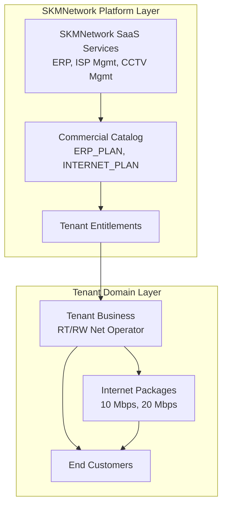

# SKMNetwork Canonical Service Taxonomy

## Purpose

This taxonomy establishes the definitive canonical structure for services, modules, and integrations within the SKMNetwork ecosystem. It explicitly bridges the gap between commercial marketing (landing page), the technical control plane (Service Registry), and the core business model, preventing architectural conflicts during implementation.

## Critical Business Model Distinction

**SKMNetwork is NOT a retail Internet Service Provider.** 
SKMNetwork does not sell Internet bandwidth directly to end-user consumers. Instead, the SKMNetwork "ISP" product is an **ISP MANAGEMENT & BILLING SaaS PLATFORM** designed for small ISPs, RT/RW Net operators, and network service providers.

To prevent architectural collapse, the data model strictly separates:

### 1. Platform Layer (SKMNetwork B2B)
- **SKMNETWORK CANONICAL SERVICE**: A macro SaaS platform capability developed/operated by SKMNetwork (e.g., ERP System, ISP Management System).
- **SKMNETWORK COMMERCIAL PLAN**: The pricing package (`plans`) purchased by a tenant business to unlock a SaaS service.
- **SKMNETWORK SUBSCRIPTION**: The entitlement (`subscriptions`) owned by the tenant, granting them access to the SaaS platform.

### 2. Tenant Layer (Tenant B2C/B2B)
- **TENANT ISP INTERNET PACKAGE**: The actual internet bandwidth package (e.g., "10 Mbps Home") created by the tenant inside their ERP/ISP Management dashboard to sell to their customers.
- **TENANT ISP END-CUSTOMER**: The individual consumer who buys internet from the tenant. They are stored as `customers` belonging to a `business_id`.

## Service vs Module vs Integration

1. **SERVICE (Macro)**: A major capability domain operated or packaged by SKMNetwork that can be commercially entitled to a tenant. (e.g., `ERP`, `ISP_MANAGEMENT`).
2. **MODULE (Micro)**: A specific feature subset *belonging* to a Service. (e.g., Inventory module inside ERP, PPPoE module inside ISP Management).
3. **INTEGRATION / PROVIDER**: An external vendor or infrastructure that a SKMNetwork Service relies upon (e.g., Meta/WhatsApp, GenieACS, MikroTik).

## Verified Services & Codes

Based on the business model audit, the canonical service codes are:

| Service Code | Display Name | Category | Service Type | Business Model |
|---|---|---|---|---|
| `ERP` | SKMNetwork ERP | OPERATIONS | INTERNAL | B2B SaaS (POS, Inventory, Finance) |
| `ISP_MANAGEMENT` | ISP Management System | OPERATIONS | INTERNAL | B2B SaaS (Billing, Radius/PPPoE mgmt) |
| `CCTV_MANAGEMENT`| CCTV Management | PROTECTION | HYBRID | B2B SaaS/Hardware Bundle |
| `WA_GATEWAY` | WhatsApp Gateway | COMMUNICATIONS| HYBRID | B2B SaaS API Wrapper |
| `AUTOPOST` | AI AutoPost | MARKETING | EXTERNAL | B2B SaaS Automation |

*Note: The code is `ISP_MANAGEMENT`, NOT `ISP`, because the platform provides the management software, not the internet transit itself. The code `CCTV_MANAGEMENT` reflects that SKMNetwork provides the operational oversight software/installation, while the hardware is external.*

## Commercial Plan Semantics

Based on the audit of `subscriptions`, `plans`, and `subscription_families`:

1. **What exactly does `INTERNET_PLAN` represent?**
   It represents a B2B SaaS subscription purchased by an ISP Tenant to use the SKMNetwork ISP Management Software. It does *not* represent a 10 Mbps retail internet connection.
2. **Who purchases it?**
   The Business Tenant (e.g., an RT/RW Net owner).
3. **Who owns the resulting customer/package?**
   The Tenant owns their `customers` (stored with `business_id`) and their own retail packages.
4. **Is the existing `plans` table a platform commercial catalog or tenant product catalog?**
   It is strictly the **SKMNetwork Platform Commercial Catalog**.
5. **Is `subscriptions` strictly SKMNetwork tenant entitlement?**
   Yes. It strictly defines which SKMNetwork SaaS plans the tenant has purchased.
6. **Does `family_code` mix concepts?**
   No. `ERP_PLAN`, `INTERNET_PLAN`, and `CCTV_PLAN` correctly represent the SaaS product families.

## Plan → Service Mapping

The backend mapping for Migration 036 must be:

| Existing Family Code | Proposed Service Code | Justification |
|---|---|---|
| `ERP_PLAN` | `ERP` | Core business operations SaaS. |
| `INTERNET_PLAN` | `ISP_MANAGEMENT` | The SaaS software to manage an ISP. |
| `CCTV_PLAN` | `CCTV_MANAGEMENT` | The SaaS/Bundle for surveillance management. |

## Future Services & Unresolved Decisions

- The separation of tenant catalogs (tenant ISP packages) from platform catalogs (`plans`) must be strictly maintained in future schema changes. The ERP must provide a separate `tenant_products` table for the tenant's own offerings.
